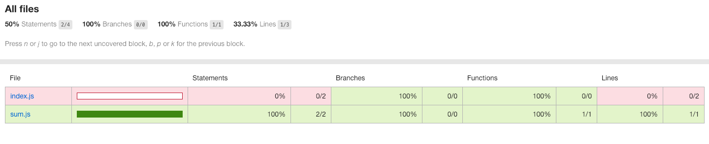

# Boilerplate for Testing NodeJs Applications with Jest and Generating Coverage Report

## Motivation

A simple and straigh forward way to introduce testing with __Jest__ to a NodeJs project, but following the [__RITE way__](https://medium.com/javascript-scene/tdd-the-rite-way-53c9b46f45e3) methodology for developing unit tests, because since i knowed it, it made me a lot of sence and has been a very valuable and also reliable tool for my day to day _Unit Testing_ developing and _TDD_ flow.

## Coverage Report for Basic Implementation

Az algoritmus sorbarendezett tömbökön működik. Megnézi az átlagkülönbséget az elemek között (avarageDifference) és ezt felhasználva megbecsüli azt az értéket ami legközelebb áll a keresett értékünkhöz képest. Ezt a megteendő lépések számában fejezi ki.
Röviden lépésről lépésre a következőkből áll:
Van egy adott növekvő sorozatunk (array-->arr) és egy keresett értékünk (target).
Következőként meghatározzuk a kezdő (startingIndex) és végső indexet (lastIndex), mely alapján keresni tudunk, illetve a keresett értéknek egy változót hozunk létre (targetPosition), melyet majd visszaad a program.
E gy ha függvénnyel kezdődik, mely megnézi, hogy az utolsó helyen áll-e a keresett értékünk. Ha igen az utolsó indexet hozzárendeli a targetPosition változóhoz amit vissza is ad és az keresett elem helyét már meg is találtuk. Ha nem akkor egy loop kezdődik, mely addig ismétlődik amíg a kezdeti és utolsó indexünk nem egyenlő (vagy kisebb). A kulcs lépés a következő két változó: avarageDifference, mely meghatározza az átlagos különbséget két elem között (Differencia) és az avarageSteps ami kiszámolja hány lépés van átlagosan a kezdő indexünk (startingIndex) és a keresett elemünk pozíciója között (target). Ezt az értéket a következő féleképpen kapjuk meg. A keresett érték és az első érték különbségét elosztjuk a köztük lévő feltételezett távolsággal, majd kerekítünk. Ebből még ki kell vonni egyet amit a következőként hozzá is adjuk. Ez azért kell, hogy ha pl a második helyen kimagaslóan nagy érték áll ([0,1000000,1000001,1000002...]) akkor is megtaláljuk a keresett értékünk helyét.
Ezek után a keresés kezdő helyét avarageSteps +1 értékkel növeljük, szűkítve keresési területünket. Azonban előfordulhat, hogy túl nagyot léptünk és 'átmentünk a cél fölött', ezért kell egy baloldali keresést indítani ami az előző helyzetet állítja vissza, kis módosítással. Mivel tudjuk, hogy az arr[startingIndex] biztos nagyobb target-nél ezért azt vehetjük végső elemnek és ki is vonhatunk egyet belőle. Így kisebb lesz a redundancia-->kevesebb értéket kell ellenőrizni és biztosítja a sikeres találatot. Feljebb ugyanez a technika vélhető fel (11.sor avarageSteps). A kezdeti értéket mindig avarageSteps értékével növeltük, ezért most csak ki kell vonni belőle.
Fontos azonban megjegyezni, hogy avarageSteps === Math.ceil((target-arr[startingIndex])/avarageDifference) ezért a +1-et is hozzá kell venni a kivonáshoz, hogy megkapjuk a helyes eredményt.
Ezután le kell ellenőrizni, hogy a startingIndex pointeren lévő érték egyezik-e a keresett értékkel (target). Ha igen meg kell adni az aktuális helyet mint targetPosition, majd a loopon kívül visszaadni ezt az értéket. Hamis érték esetén folytatódik az ismétlődés míg az elején meghatározott állítás igaz marad.

Konklúzió: A linearitástól függ a keresési idő, nem a tömb méretétől illetve, hogy van-e kirívóan nagy különbség két egymást következő elem között. Ezáltal pontosan az idejét se lehet meghatározni.

Pár teszt jó eredményeket mutatott, csak nem tudtam elég nagy számokkal dolgozni ram hiány miatt, így nem megbízható teljes mértékben. Van már új, nagyobb és bonyoltabb teszt, elküldtem ismerősömnek, várom a választ. Remélem érthető volt:)